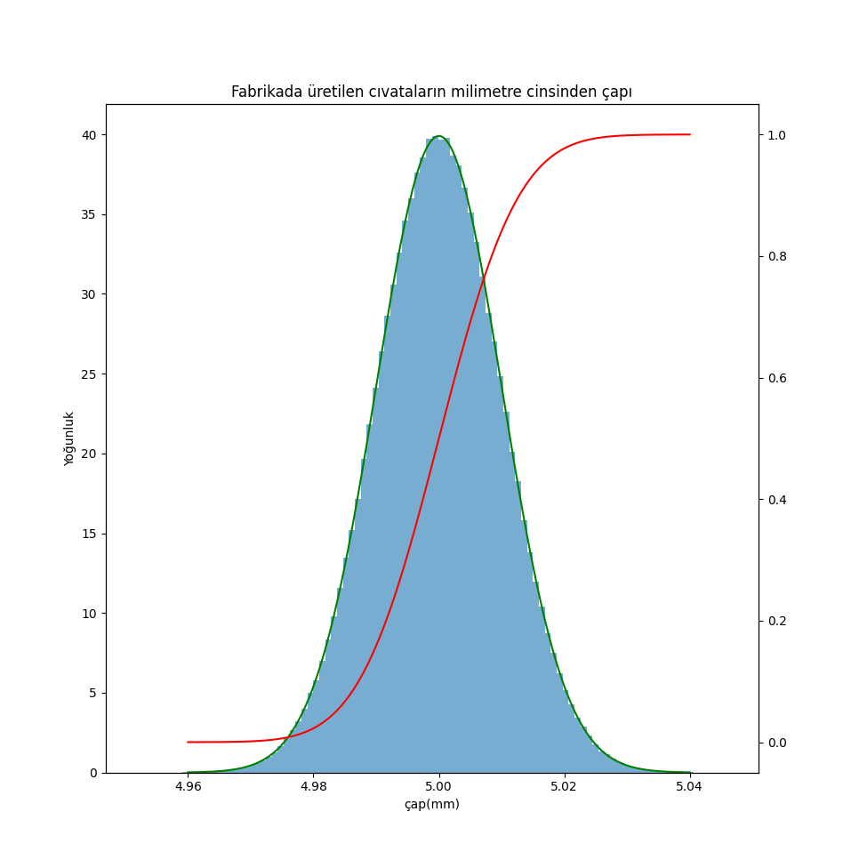

# 📊 Distribution Simulation with Python

This project simulates probability distributions using Python and visualizes them with histograms, Probability Density Function (PDF), and Cumulative Distribution Function (CDF).

## 🚀 Features

* Generate random data using Normal Distribution
* Visualize data using histogram
* Plot theoretical PDF and CDF
* Compare simulation vs theory

## 🛠️ Technologies Used

* Python
* NumPy
* Matplotlib
* SciPy

## 📷 Example Output



## 📌 What I Learned

* Difference between PDF and CDF
* Effect of mean and standard deviation
* Data simulation using NumPy
* Visualization using Matplotlib

## ▶️ How to Run

```bash
pip install -r requirements.txt
python distribution_simulation.py
```

## 📊 Example Scenario

Simulating bolt diameters produced in a factory with high precision.

* Mean = 5 mm
* Standard deviation = 0.01

## 💡 Future Improvements

* Add other distributions (Uniform, Exponential)
* Build interactive dashboard
* Allow user input for parameters
